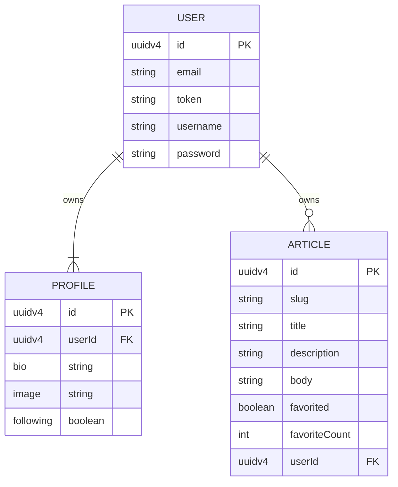

# Real world app - Monolith

This is a monolith (literally on purpose) representing the backend of the real world app.
I chose to use a single file. to be as litteral as I could about the **Monolithic** essence of this repo.

# ERD (entity relation diagram)

